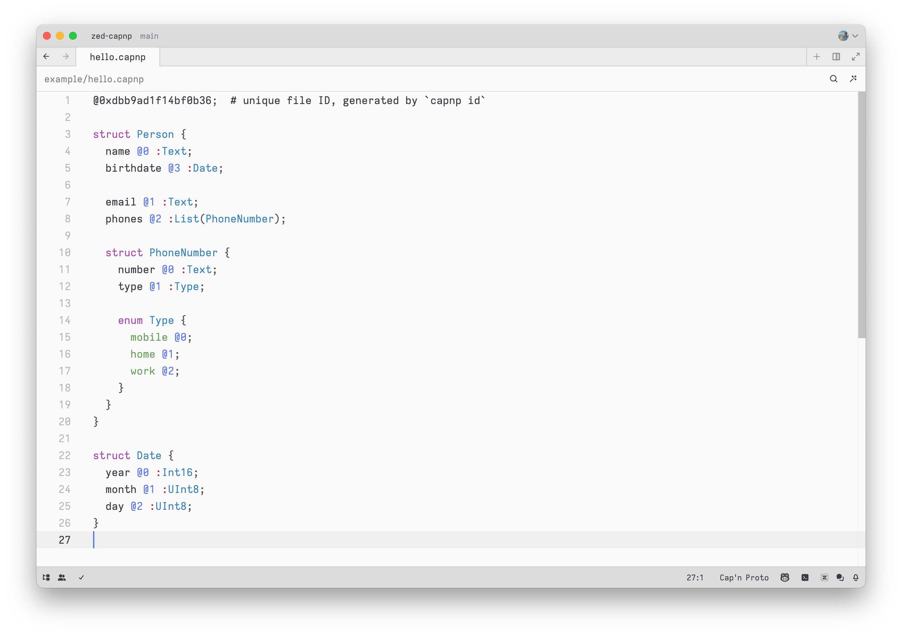

# zed-capnp

[Cap'n Proto](https://capnproto.org) grammar for [Zed.dev](https://zed.dev).

This plugin builds on the [tree-sitter-capnp](https://github.com/tree-sitter-grammars/tree-sitter-capnp) grammar to provide syntax highlighting and language support for Cap'n Proto files in Zed.

